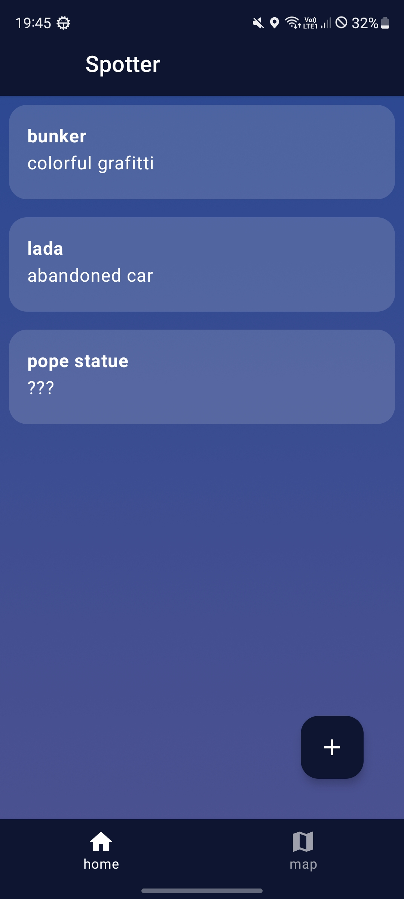
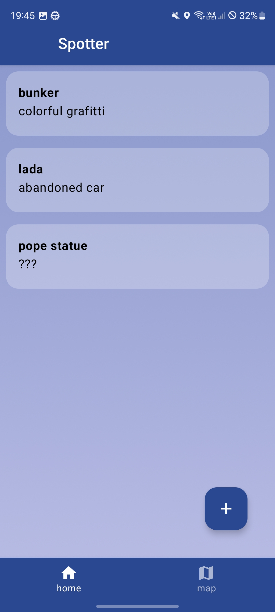
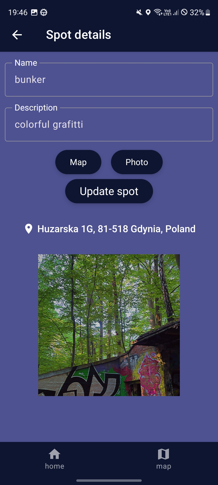
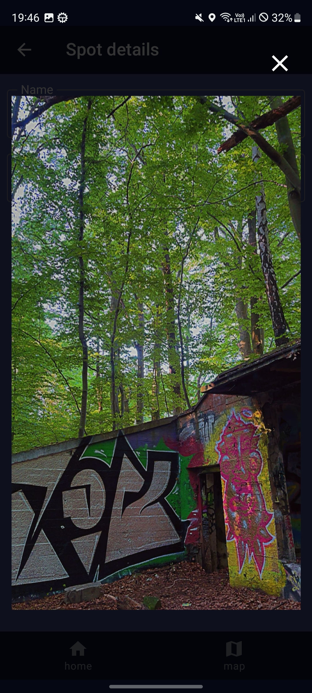
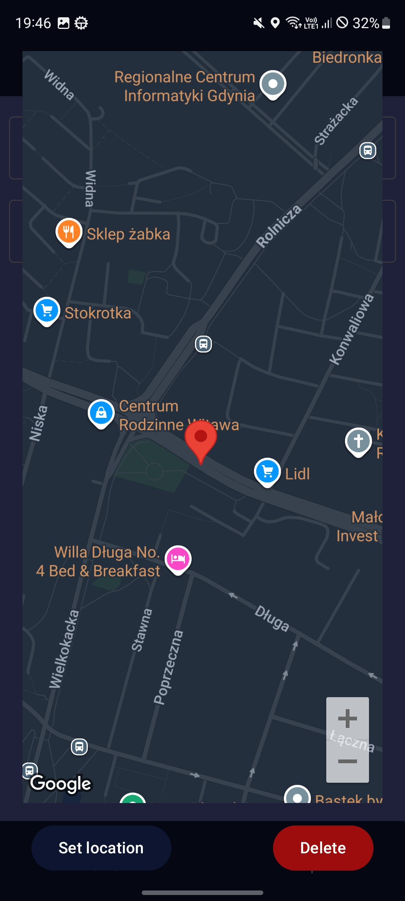
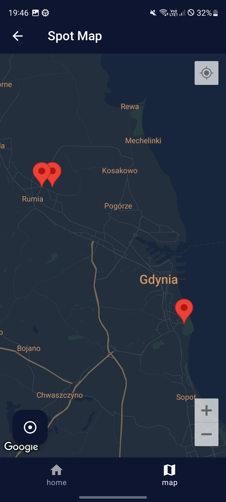

# Spotter
Simple kotlin android app for managing interesting places
Created to showcase my skills in android development

## Main Features
- Places list with add/edit/delete
- Map integration with location picker
- Map screen with all spots
- Reading the address from the location
- Photos support
- Location and camera permission service
- Local storage (Room DB)
- API requests with Retrofit
- Dark theme support

## Built with
- Kotlin
- Jetpack Compose
- Jetpack Navigation
- MVVM + Repository 
- Coroutines & Flow
- Room Database
- Retrofit (Geocoding API)
- Google Maps SDK
- 
## Screenshots

  
  
  

  
  
  

